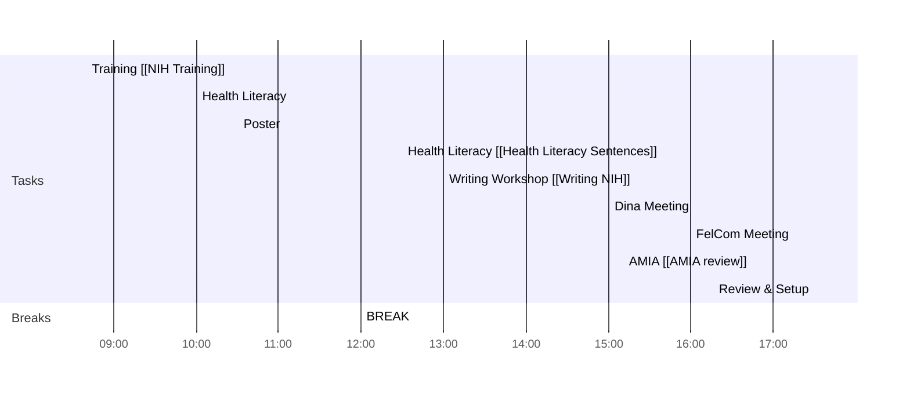

## Day Planner
# Weekly Goals ✅
  - [ ] Trajectory Clusters 
  - [ ] AMIA Review 
  - [ ] Health Literacy [[Health Literacy Sentences]]
  - [ ] Signature Email/Book Travel
  - [ ] 4h deep work 3 days per week (set on the calendar)
  - [ ] Coursera
  - [ ] Dina-Gaetano IDP
  - [ ] LJ email
### Meeting Daily Tasks 💚 
1. Gozda ?
### Morning 🔨
- [ ] 08:30 Lj Email
- [ ] 08:45 AMIA [[AMIA review]] [[Answer Review AMIA]]
- [ ] 09:30 Signature Email/Book Travel
- [ ] 09:40 BREAK
- [ ] 10:00 EmoMap
- [ ] 12:00 BREAK
### Lunch 👀
- [ ] 12:30 Read
### Afternoon 👻
- [ ] 13:00 Trajectory clustering [[Trajectory Colab]]
- [ ] 15:00 BREAK
- [ ] 16:00 Dina-Gaetano IDP
- [ ] 16:30 Coursera
- [ ] 17:30 Review & Setup
- [ ] END

