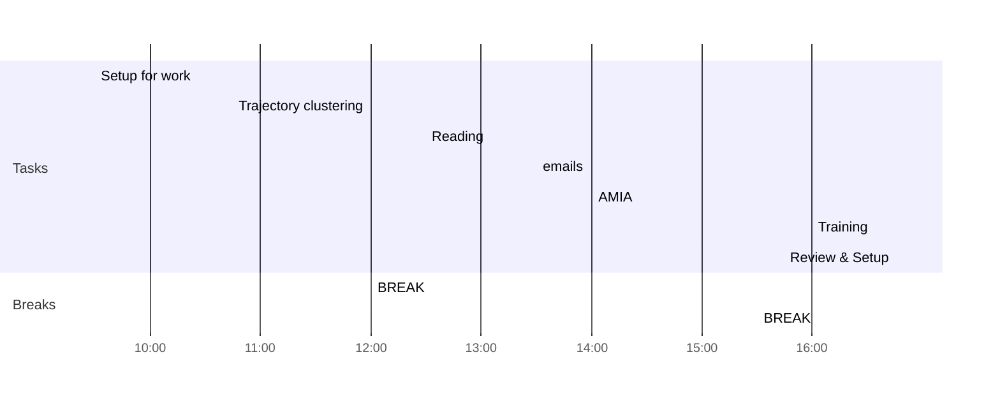

## Day Planner

This is my plan for the day broken into 4 main sections:
1. Trajectory
2. AMIA
3. Training
4. Review
### Morning Prep

- [ ] 09:30 Setup for work
- [ ] 10:45 Trajectory clustering
- [ ] 12:00 BREAK

### Reading

- [ ] 12:30 Reading

### Afternoon Review

I use this time to review what I have done earlier in the day and complete any tasks to prepare for the next day.

- [ ] 13:30 emails
- [ ] 14:00 AMIA
- [ ] 15:30 BREAK
- [ ] 16:00 Training
- [ ] 16:45 Review & Setup
- [ ] END