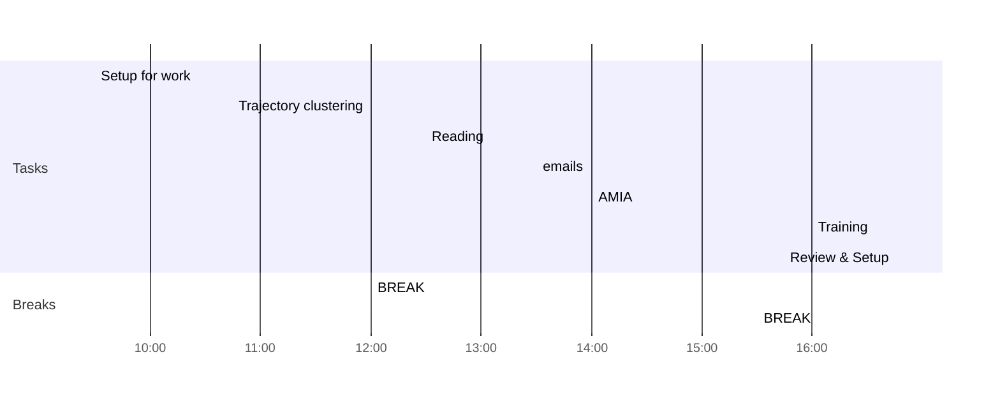

# Weekly Goals ✅

  - [ ] Trajectory
  - [ ] AMIA
  - [ ] Health Literacy [[Health Literacy Sentences]]
  - [ ] 4h deep work 3 days per week (set on the calendar)
  

### Main Daily sections:
1. Trajectory
2. AMIA
3. Training
4. Review
### Morning Prep
- [x] 09:30 Setup for work
- [ ] 10:45 Trajectory clustering [link](https://colab.research.google.com/drive/1HrGCJlFOMvyQG-VTBkC7A59VTmCuDUwx)
- [ ] 12:00 BREAK

### Reading
- [ ] 12:30 Reading

### Afternoon Review
- [ ] 13:30 emails
- [ ] 14:00 AMIA [[AMIA review]]
- [ ] 15:30 BREAK
- [ ] 16:00 Training https://irtsectraining.nih.gov/
- [ ] 16:45 Review & Setup 
- [ ] END

