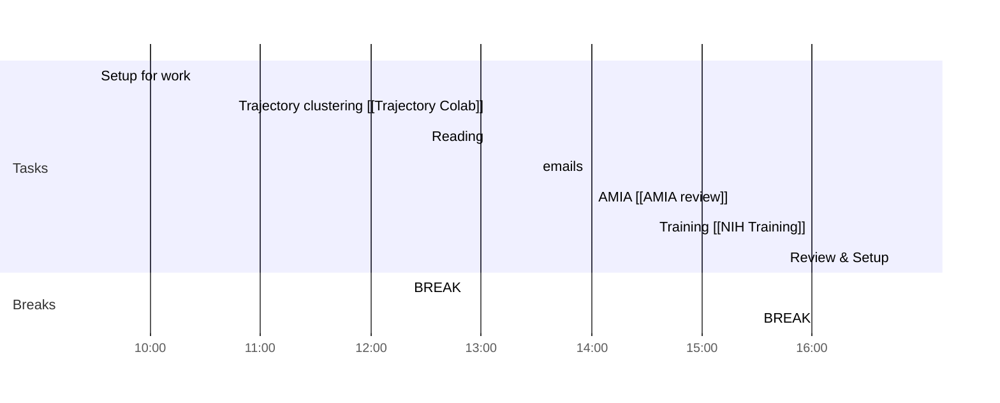

# Weekly Goals ✅
  - [ ] Trajectory Clusters 
  - [ ] AMIA Review 
  - [ ] Health Literacy [[Health Literacy Sentences]]
  - [ ] Signature Email/Book Travel
  - [ ] 4h deep work 3 days per week (set on the calendar)
### Main Daily Tasks 💚 
- [ ] Trajectory
- [ ] AMIA
- [ ] Training
- [ ] Review
### Morning 🔨
- [x] 09:30 Setup for work
- [x] 10:45 Trajectory clustering [[Trajectory Colab]]
- [x] 12:20 BREAK
### Lunch 👀
- [x] 12:30 Reading
### Afternoon 👻
- [x] 13:30 emails
- [ ] 14:00 AMIA [[AMIA review]]
- [ ] 15:30 BREAK
- [ ] 16:00 Training [[NIH Training]]
- [ ] 16:45 Review & Setup
- [ ] END

