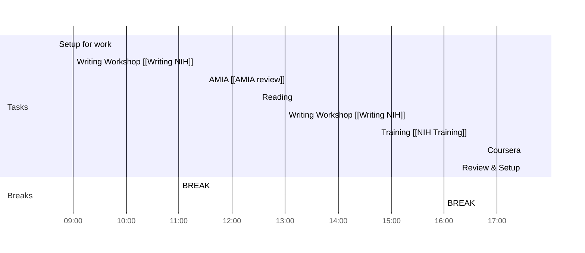

# Weekly Goals ✅
  - [ ] Trajectory Clusters 
  - [ ] AMIA Review 
  - [ ] Health Literacy [[Health Literacy Sentences]]
  - [ ] Signature Email/Book Travel
  - [ ] Writing Workshop & Training 
  - [ ] 4h deep work 3 days per week (set on the calendar)
### Main Daily Tasks 💚 
1. Writing Workshop
2. AMIA
3. Training
### Morning 🔨
- [x] 08:40 Setup for work
- [x] 09:00 Writing Workshop [[Writing NIH]]
- [x] 11:00 BREAK
- [ ] 11:30 AMIA [[AMIA review]]

### Lunch 👀
- [ ] 12:30 Reading
### Afternoon 👻
- [ ] 13:00 Writing Workshop [[Writing NIH]]
- [ ] 16:00 BREAK
- [ ] 16:30 Training [[NIH Training]]
- [ ] 16:45 Coursera
- [ ] 17:30 Review & Setup
- [ ] END

