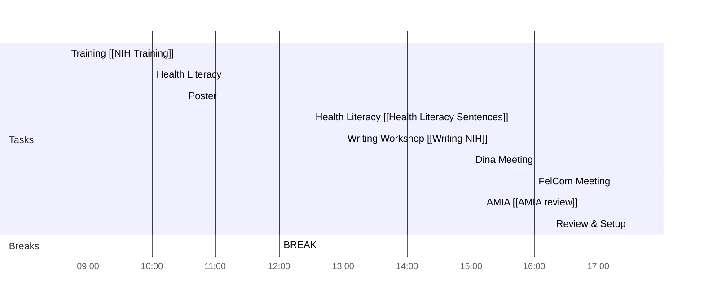

## Day Planner
# Weekly Goals ✅
  - [ ] Trajectory Clusters 
  - [ ] AMIA Review 
  - [ ] Health Literacy [[Health Literacy Sentences]]
  - [ ] Signature Email/Book Travel
  - [x] Writing Workshop & Training 
  - [ ] 4h deep work 3 days per week (set on the calendar)
  - [ ] Coursera
  - [ ] Dina-Gaetano IDP
  - [ ] LJ email
### Main Daily Tasks 💚 
1. Trajectory
2. AMIA
3. Training
### Morning 🔨
- [ ] 08:30 Lj Email
- [ ] 08:45 AMIA [[AMIA review]] [[Answer Review AMIA]]
- [ ] 09:30 
- [ ] 09:40 BREAK
- [ ] 10:00 EmoMap
- [ ] 12:00 BREAK
### Lunch 👀
- [ ] 12:30 Read
### Afternoon 👻
- [ ] 13:00 Writing Workshop [[Writing NIH]]
- [ ] 15:00 Dina Meeting
- [ ] 16:00 FelCom Meeting
- [ ] 16:45 AMIA [[AMIA review]]
- [ ] 17:30 Review & Setup
- [ ] END

confirmation number L56MNW
4XE7K323UE Manzo
71LR6MN5AH Campmas

