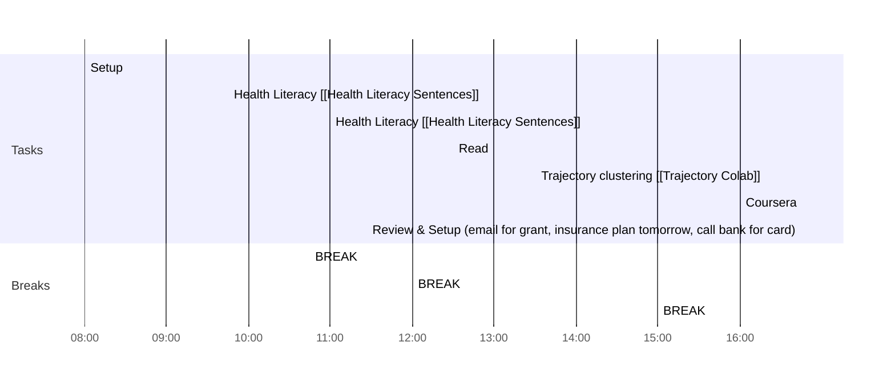

# Weekly Goals ✅
  - [ ] Trajectory Clusters 
  - [ ] EmoMap
  - [x] AMIA Review 
  - [ ] Health Literacy [[Health Literacy Sentences]]
  - [x] Signature Email/Book Travel
  - [ ] 4h deep work 3 days per week (set on the calendar)
  - [ ] Coursera
  - [x] Dina-Gaetano IDP
  - [x] Format ref AMIA
  - [x] LJ email
## Day Planner
### Meeting Daily Tasks 💚 

### Morning 🔨
- [x] 08:00 Setup
- [x] 09:45 Health Literacy [[Health Literacy Sentences]]
- [ ] 10:45 BREAK
- [ ] 11:00 Health Literacy [[Health Literacy Sentences]]
- [ ] 12:00 BREAK
### Lunch 👀
- [ ] 12:30 Read
### Afternoon 👻
- [ ] 13:30 Trajectory clustering [[Trajectory Colab]]
- [ ] 15:00 BREAK
- [ ] 16:00 Coursera
- [ ] 16:45 Review & Setup (email for grant, insurance plan tomorrow, call bank for card)
- [ ] END

