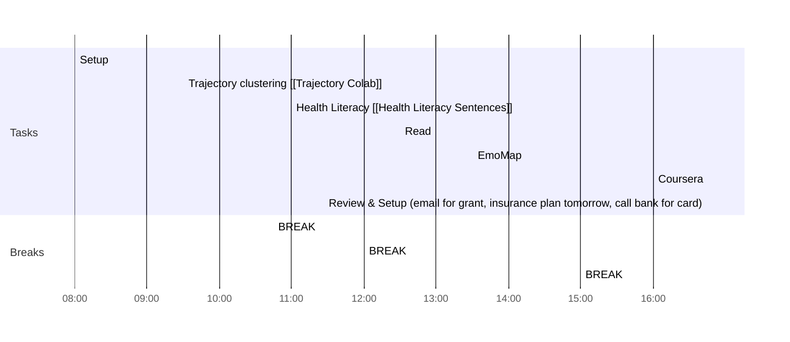

# Weekly Goals ✅
  - [ ] Trajectory Clusters 
  - [ ] EmoMap
  - [ ] Excel and Registration Lin
  - [ ] Health Literacy [[Health Literacy Sentences]]
  - [ ] 4h deep work 3 days per week (set on the calendar)
  - [ ] Coursera

## Day Planner

### Meeting Daily Tasks 💚 

### Morning 🔨
- [x] 08:00 Setup
- [x] 09:30 Trajectory clustering [[Trajectory Colab]]
- [x] 10:45 BREAK
- [ ] 11:00 Health Literacy [[Health Literacy Sentences]]
- [ ] 12:00 BREAK
### Lunch 👀
- [ ] 12:30 Read
### Afternoon 👻
- [ ] 13:30 EmoMap
- [ ] 15:00 BREAK
- [ ] 16:00 Coursera
- [ ] 16:45 Review & Setup (email for grant, insurance plan tomorrow, call bank for card)
- [ ] END

