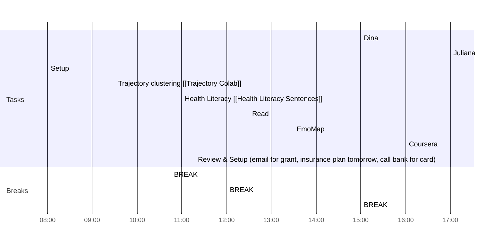

## Day Planner

- One task to elevate my **business** (write an article, create a new product, work on marketing, etc.)
- One task to elevate my **health** (lifting weights, going for a run, walking in nature, etc.)
- One task to elevate my **finances** (research potential investments, manage my finances, etc.)

# Weekly Goals ✅
  - [ ] Trajectory Clusters 
  - [ ] EmoMap
  - [ ] Excel and Registration Link
  - [ ] Health Literacy [[Health Literacy Sentences]]
  - [ ] 4h deep work 3 days per week (set on the calendar)
  - [ ] Coursera
### Meeting Daily Tasks 💚 
- [ ] 15:00 Dina
- [ ] 17:00 Juliana

### Morning 🔨
- [x] 08:00 Setup
- [x] 09:30 Trajectory clustering [[Trajectory Colab]]
- [x] 10:45 BREAK
- [x] 11:00 Health Literacy [[Health Literacy Sentences]]
- [x] 12:00 BREAK
### Lunch 👀
- [ ] 12:30 Read
### Afternoon 👻
- [ ] 13:30 EmoMap
- [ ] 15:00 BREAK
- [ ] 16:00 Coursera
- [ ] 16:45 Review & Setup (email for grant, insurance plan tomorrow, call bank for card)
- [ ] END

